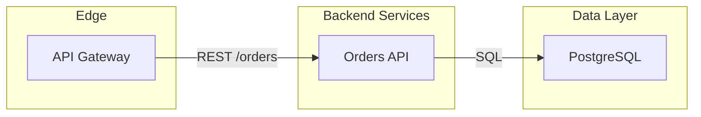

# Mermaid Authoring For Diagramify

## Evidence And Scope

- Represent components and relationships that are supported by repository evidence or the user's description.
- Distinguish runtime architecture from build, deployment, and CI concerns. Use separate diagrams when combining them harms readability.
- Label inferred relationships explicitly, or disclose them with the final output.
- Prefer a focused diagram with a clear title and viewpoint over a comprehensive but unreadable graph.

## Architecture Flowcharts

Use stable alphanumeric or underscore node IDs and precise human-readable labels:

- Group by responsibility, deployment boundary, or trust boundary.
- Use exact service names such as `PostgreSQL`, `Redis`, or `Amazon S3`; these improve icon matching.
- Label edges with protocols, commands, or data such as `REST`, `gRPC`, `SQL`, `events`, or `OIDC`.
- Use solid arrows for synchronous interactions and dashed arrows for asynchronous flows.
- Keep edge crossings low by choosing `LR` or `TD` deliberately.
- Avoid generic nodes such as `Backend`, `Database`, or `Service` when the concrete component is known.

## Sequence Diagrams

- Limit the diagram to one scenario.
- Order participants by the direction of the main request.
- Include meaningful responses and failure branches only when relevant.
- Name messages with actions or payloads rather than vague labels.

## ER And Class Diagrams

- Include only relationships supported by schemas, migrations, ORM models, or types.
- Show key cardinalities and important fields; omit incidental fields.
- Split large domains into bounded-context diagrams.

## State Diagrams

- Derive states and transitions from explicit enums, transition tables, workflow code, or the user's description.
- Label transitions with the event or condition that causes them.
- Include terminal and failure states when they materially affect the workflow.

## Revision And Diffability

- Keep node IDs stable when labels change.
- Make one conceptual change per revision when a useful diff is required.
- Preserve the previous `.mmd` before major revisions.
- Render after each substantial edit; syntactically plausible Mermaid can still fail in Diagramify's renderer.

## Output Selection

- `mmd`: always retain as source of truth.
- `html`: best for interactive review and exploration; it may load web-hosted assets.
- `svg`: best for deterministic inspection, docs, and versioned output.
- `png`: use for slides, issue attachments, and broad compatibility.
- `jpeg`: use only when lossy raster output is specifically useful.
